# Build Overlapping Stacked Denisty Plot


## Package installation

```
if(!require(devtools)){
    install.packages(devtools)
}

devtools::install_github("haoeric/StackedDensityPlot", dependencies = TRUE)
```


## Package Usage

### Demo with Two Public Datasets

```
## iris data
head(iris)
```

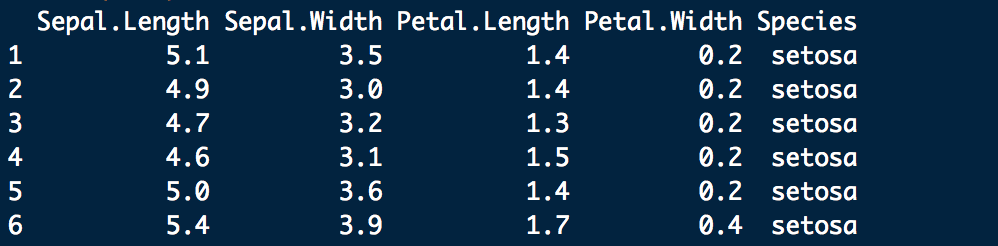

```
summary(iris)
```

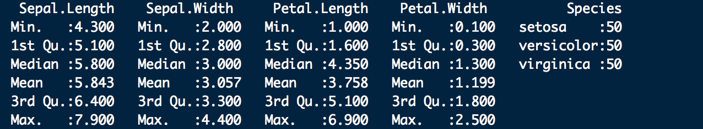


```
## wine data
data(wine, package='rattle')
head(wine)
```
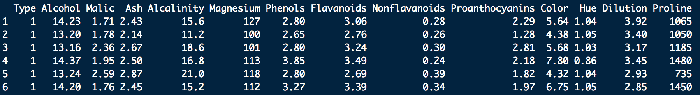

```
summary(wine)
```

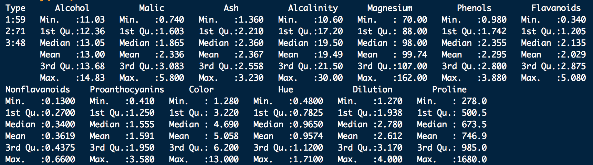


### Create Overlapping Stacked Denisty Plot

```
library(StackedDensityPlot)
stackedDenistyPlot(iris, densityColNames = colnames(iris)[1:4], stackFactor = iris$Species)
```
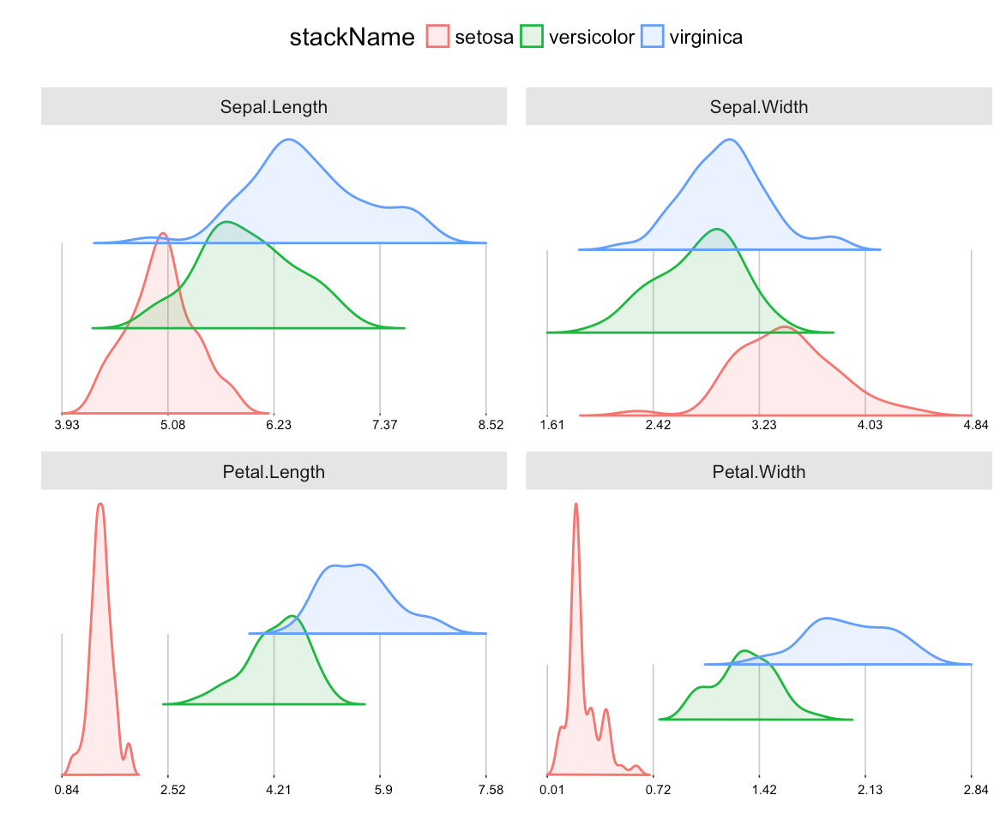

```
stackedDenistyPlot(wine, densityColNames = colnames(wine)[2:13], stackFactor = wine$Type)
```

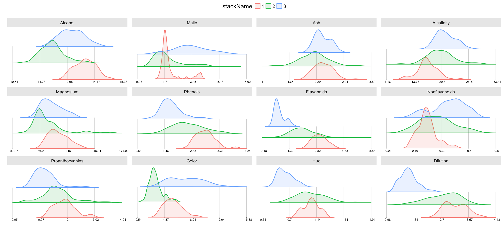

### Change the overlapping percentage

```
## fully overlap
stackedDenistyPlot(wine, densityColNames = colnames(wine)[c(2,4,5,7)], stackFactor = wine$Type, stackSeperation = 0)
```

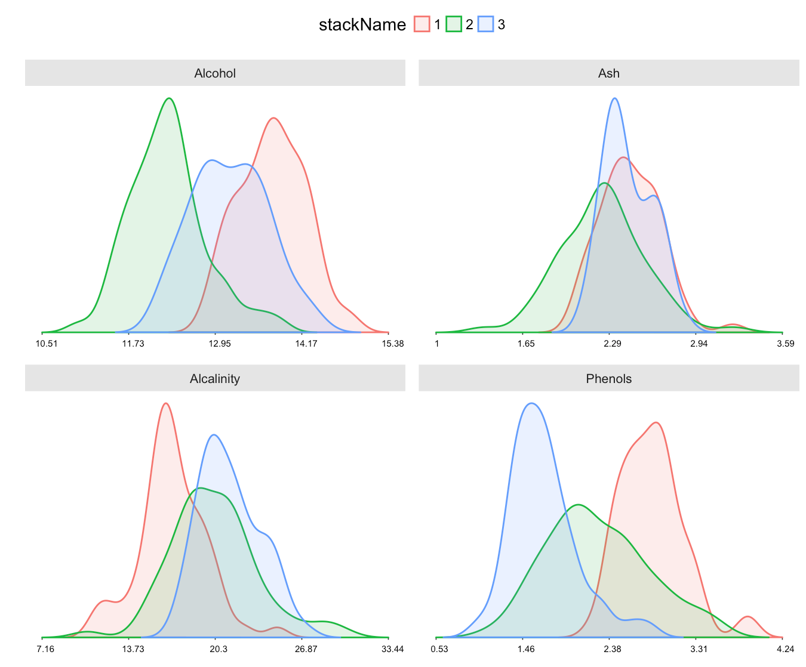

```
## 30% overlap
stackedDenistyPlot(wine, densityColNames = colnames(wine)[c(2,4,5,7)], stackFactor = wine$Type, stackSeperation = 0.3)
```
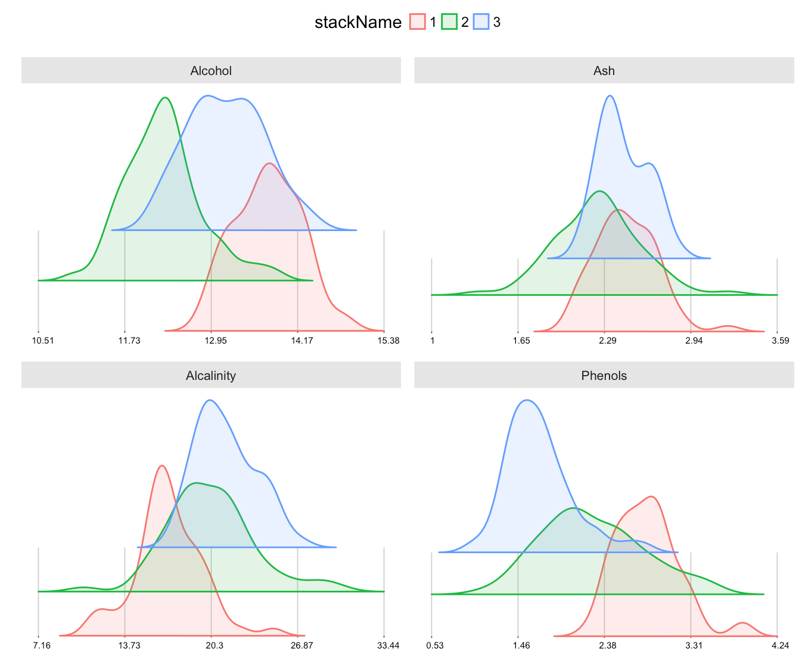

### Adjust the Rotation Degree of Stacks

```
stackedDenistyPlot(wine, densityColNames = colnames(wine)[c(2,4,5,7)], stackFactor = wine$Type, stackRotation = 8)
```

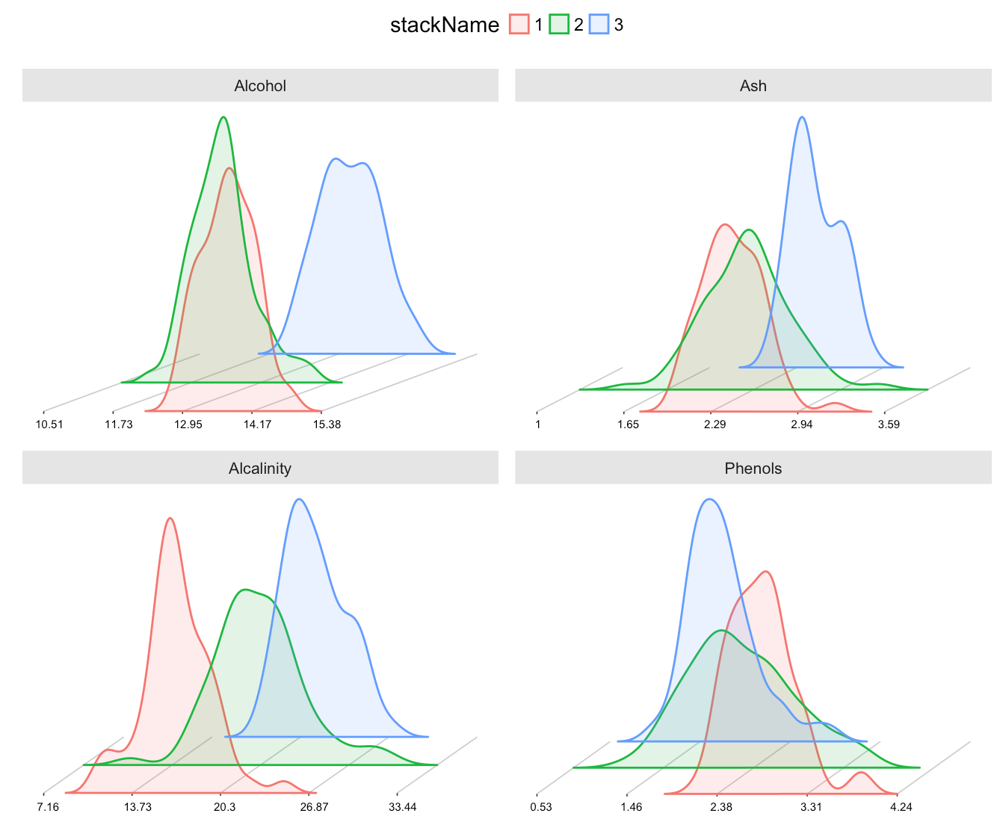

### Specify the Stack Colors

```
my_colors <- c("green", "Blue", "Red")
stackedDenistyPlot(wine, densityColNames = colnames(wine)[c(2,4,5,7)], stackFactor = wine$Type, stackRotation = 0, stackColor = my_colors)
```

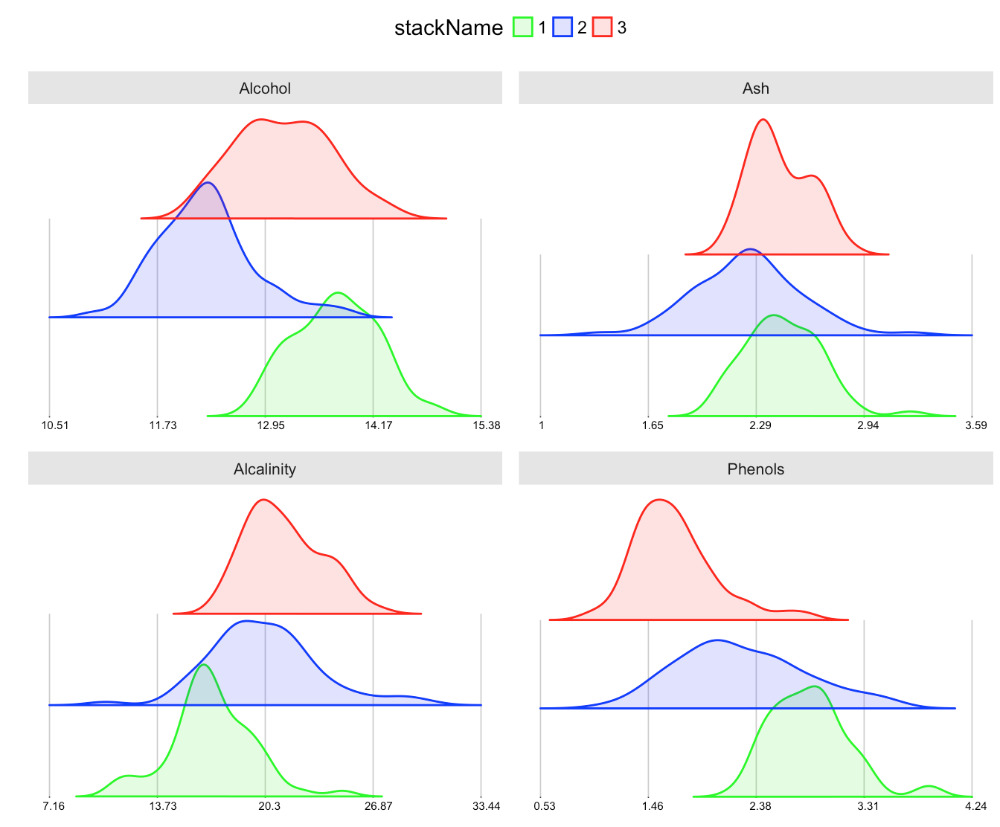

### More Adjustment Options 

Like change the Size of legends, stripe labels, legend keys, x label text, etc.

```
my_colors <- c("green", "Blue", "Red")
stackedDenistyPlot(wine, densityColNames = colnames(wine)[c(2,4,5,7)], stackFactor = wine$Type, stackRotation = 0, stackColor = my_colors, x_text_size = 2, strip_text_size = 10, legend_text_size = 0.8, legendRow = 1, legend_title = "Wine Type", legend_title_size = 1, legend_key_size = 0.15)
```

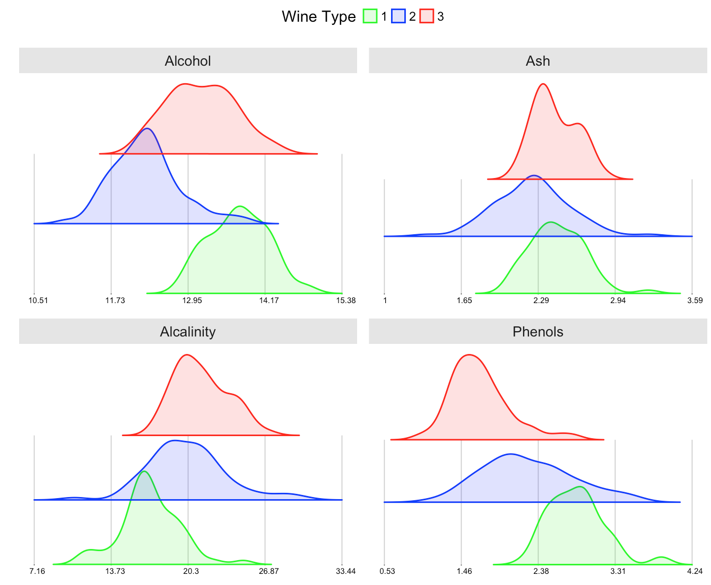
